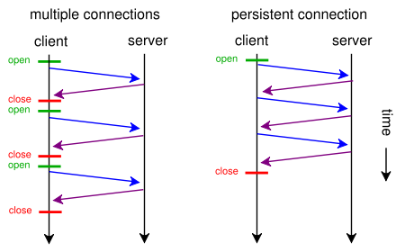
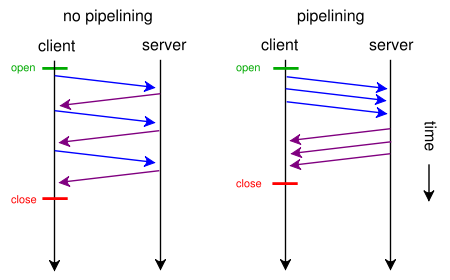

# 4.HTTP/1.1のシンタックス：高速化と安全性を求めた拡張

本章で取り上げる、プロトコルシンタックスとしてのHTTP/1.1の変更点は次の通り。

 - 通信の高速化
    - Keep-Aliveがデフォルトで有効に
    - パイプライニング
- TLSによる暗号化通信のサポート

----
 以下は後半
 
- 新メソッドの追加
    - PUTとDELETEが必須のメソッドとなった
    - OPTION, TRACE, CONNECT メソッドが追加
- プロトコルのアップグレード
- 名前を使ったバーチャルホストのサポート
- サイズが事前にわからないコンテンツのチャンク転送エンコーディングのサポート

## 4.1 通信の高速化
キャッシュはコンテンツのリソースごとに通信を最適化する技術だが、Keep-Aliveと、パイプライニングはより汎用的な、すべてのHTTP通信を高速化する機能である。

### 4.1.1 Keep-Alive
Keep-Aliveは、HTTPの下のレイヤーであるTCP/IPの通信を効率化する仕組み。

Keep-Aliveを使わない場合は、ひとつのリクエストごとに通信を閉じるが、Keep-Aliveを使うと連続したリクエストの時に接続を再利用する。TCP/IPは接続までの待ち時間が減り、通信速度が上がったように感じる。



(1回のTCP接続で複数のHTTPリクエストを処理する機能)

Keep-Aliveによる通信は、クライアント、サーバーのどちらかが次のヘッダーを付与して接続を切るか、タイムアウトするまで接続が維持される。

```
Connection: Close
```

Keep-Aliveの接続時間は、クライアントとサーバーの両方が持っている。片方がTCP/IPの切断を行った瞬間に通信が完了するため、どちらか短い方が採用される。


>*参照*
- [持続接続](https://docs.oracle.com/javase/jp/6/technotes/guides/net/http-keepalive.html)
- [TCP/IP通信とは](http://research.nii.ac.jp/~ichiro/syspro98/tcpip.html)
- [Nginx の keep-alive の設定と検証](http://www.nari64.com/?p=579)


### 4.1.2 パイプライニング
パイプライニングは最初のリクエストが完了する前に次のリクエストを送信し、「レスポンスを待って次のリクエストを出す」までの待ち時間を排除することでネットワークの稼働率をあげ、パフォーマンスを向上させる機能。

Keep-Aliveの利用を前提としている。また、仕様上、サーバーはリクエストが来た順序でレスポンスを返すことになっている。



レスポンスの生成に時間がかかる処理やファイルサイズの大きいファイルを返す処理があると、他のレスポンスを阻害する。これはHead-of-Blocking(HOL Blocking)と呼ばれる問題。

パイプライニングのパフォーマンスが活かしきれなかった問題があった。

*後のHTTP/2においてストリームという新しい仕組みとして生まれ変わった*

## 4.2 TLS(トランスポート・レイヤー・セキュリティ)

HTTP/1.1と並行して通信経路を暗号化するTLSが規格化された。

TLSはHTTP/1.1と共同利用されることを強く意識して作られたが、TLSの暗号化自体はHTTPに依存せず、さまざまな形式のデータを双方向に流すことができる。TLSは、既存のプロトコルに通信経路の安全性をプラスした新たなプロトコルを作り出すことのできる汎用的な仕組みになっている。

| プロトコル | ポート |
|:-----------|------------:|
| HTTP       | 80        |
| HTTPS(HTTP Secure)     | 443      |
| SMTP       | 25        |
| SMTPS         | 465          |

既存のプロトコルのバージョンアップに利用されている。

HTTPの通信を途中で中継するゲートウェイから見ると「暗号化されていて通信の内容をのぞいたり変更ができない双方向通信」。

TLSはいくつかバージョンがありSSLと呼ばれていた頃もあった。現在のSSLは、さまざまな脆弱性が知られており、RFC上でも非推奨とされている。実際に使われているのはほとんどがTLSである。

### 4.2.1 ハッシュ関数

入力データから、ルールに従ってデータを集約していくことで、ハッシュ値と呼ばれる短いデータを作り出す。

ハッシュ関数には暗号化通信を行う上で便利な数学的特性がある。
ハッシュ関数をh(), 入力データをA, B...., 算出されたハッシュ値を X, Y... とする。長さは len() とする。

- 同じアルゴリズムと同じ入力データであれば、結果として作られるハッシュ値は同じになる。
    - h(A) = X が常になりたつ
- ハッシュ値はアルゴリズムが同じであれば、同じ長さとなる。
- ハッシュ値から元のデータを類即することは難しい（弱衝突体制）
- 同一ハッシュ値を持つ任意のデータの組みを見つけるのが難しい（強衝突体制）

ハッシュ関数はコンピュータの中で様々な用途につかわれている。
例えば、バージョン管理システムのGitでは、ファイルを管理するときにファイル名ではなくファイルの内容をもとにしたハッシュ値を用いており、このハッシュ値をキーにしてファイルをデータベースに格納している。
同じ内容のファイルが複数あった場合、データの実態は一つで済む。
また長大なデータファイル全てを比較せずハッシュ値だけを比較することで、すばやく「ファイルの内容がことなる」ことを判定できる。

セキュリティ用途でも、ハッシュ値は内容の同一性を判断する用途で使われる。

```
$ openssl sha1 keep-alive.png
SHA1(keep-alive.png)= 3b722faa3669ffde26795abafece1b4bb881f581
```

### 4.2.2 共通鍵暗号と公開鍵暗号とデジタル署名

暗号のアルゴリズムで大事だとされていることは、アルゴリズムそのものを秘密にするのではなく、アルゴリズムが公開されていても安全に通信できることである。

現在一般的に使われるのは、暗号化方式はオープンだが、その暗号化に使うデータ（鍵）を別に用意する方式である。TLSで使われているものには、共通鍵方式と、公開鍵方式の2種類がある。

#### 共通鍵方式
- 対象暗号とも呼ばれる。
- 鍵をかけるのと鍵をあけるのに同じ鍵を使う方式。

「鍵のデータに従ってデータを壊す」

鍵があれば壊れたデータから正しく修理することができるので、受け取り手はデータを復元して読める。TLSでは、通常の通信の暗号化に使う。

#### 公開鍵方式
- 非対称暗号とも呼ばれる。
- 必要なものは公開鍵と秘密鍵。

暗号化する鍵と、それを復元かする鍵が別になっている。暗号化する方が公開鍵で、復号化する方が秘密鍵である。

例えると、公開鍵は南京錠、秘密鍵はその鍵である。

#### デジタル署名
- 公開鍵方式の応用例
- 逆に鍵の方をくばって、南京錠を秘密にしておくようなイメージ

### 4.2.3 鍵交換
鍵交換は、クライアントとサーバー間で鍵を交換する。

#### DH(ディフィー・ヘルマン)鍵交換アルゴリズム
鍵そのものを交換せず、クライアントとサーバーでそれぞれ鍵の材料を作り、お互いに交換しあって、それぞれの場所で計算して同じ鍵を得る。

[Diffie-hellman key exchange
](https://www.khanacademy.org/computing/computer-science/cryptography/modern-crypt/v/diffie-hellman-key-exchange-part-2)

### 4.2.4 共通鍵方式と公開鍵方式を使い分ける理由
TLSは、両方の方式を組み合わせている。通信毎に一度だけ使われる共通鍵を作り、公開鍵方式を使って通信相手へ厳重に鍵を受け渡し、その後は共通鍵で高速に暗号化を行うという2段階の方式を利用している。

公開鍵方式の方が安全性は高いのだが、鍵を持っいたとしても暗号化と復号化に必要な計算量が共通鍵方式に比べて大きすぎるためである。

実際に使用されている共通鍵（AES）と、公開鍵方式（RSA）のパフォーマンスを測定してみる。

[benchmark_common_and_public_key_test.go](https://github.com/jb-matsunaga/RealWorldHTTP/blob/master/04/benchmark_common_and_public_key_test.go)


▽ベンチマークの結果

| 暗号方式 | モード | 時間(ナノ秒)| スルーピット|
|:--------|----------|----------|------------:|
| RSA     | 暗号化    |84338  |1.5MB/秒|
| RSA     | 復号化    |2874037| 45KB/秒|
| AES     | 暗号化    |184    |690MB/秒|
| AES     | 復号化    |184    |690MB/秒|

RSA(公開鍵)よりAES(共通鍵)の方が断然速い

### 4.2.5 TLSの通信手順

TLSの通信は大きく3つに分けることができる。
- ハンドシェイクプロトコル通信を確立するステップ
- レコードプロトコル通信時のステップ
- SessionTicketという仕組みを使った、再接続時の高速なハンドシェイク

1. SSLサーバー証明書を取得
2. サーバー証明書の信頼性を確認
3. 共通鍵を作成し、証明書内の公開鍵で暗号化
4. 暗号化された鍵の復号
5. 復号した鍵で通信

#### 4.2.5.1 サーバーの信頼性を確認
サーバーの信頼性を保証する仕組みは、公開鍵の保証する仕組みでもあり、公開鍵基盤(Public Key Infrastructure)と呼ばれる。ブラウザはサーバーから、そのサーb−の持つSSLサーバー証明書と呼ばれるものを取得するところからスタートする。

サイトの主体者（Sbject:名前とドメイン名）、発行者、主体者のサーバーの公開鍵、有効期限などの項目がある。発行者は認証局とも呼ばれる。信頼性の確認のポイントは発行者である。

証明書には発行者のデジタル署名がついている。その発行者の証明書を取得することで署名を検証できる。そして、そのまた親の発行者の証明書も順番に検証していく。最終的には、発行者と主体者が同一の証明書が出てくる。これはルート認証局と呼ばれる。

ブラウザやOSには、あらかじめ信頼できる認証曲の証明書がインストールされている。この証明書と照合することで最終的にサーバーが承認されたものであることが確認できる。

信頼が確認されなかった発行者と主体者が同一の証明書は、「オレオレ証明書」という通称で呼ばれる。

外部に公開されているサービスであれば、証明書は誰でも取得できる。opensslコマンドを使ってGoogleの証明書を取得してきて、中身を確認してみる。

```javascript
$ openssl s_client -connect www.google.com:443 < /dev/null > google.crt
$ openssl x509 -in google.crt -noout -text
Certificate:
    Data:
        Version: 3 (0x2)
        Serial Number:
            2e:8e:5c:b0:3c:19:1c:44
        Signature Algorithm: sha256WithRSAEncryption
        Issuer: C=US, O=Google Inc, CN=Google Internet Authority G2
        Validity
            Not Before: Jul 25 08:40:46 2017 GMT
            Not After : Oct 17 08:28:00 2017 GMT
        Subject: C=US, ST=California, L=Mountain View, O=Google Inc, CN=www.google.com
        Subject Public Key Info:
            Public Key Algorithm: rsaEncryption
            RSA Public Key: (2048 bit)
                Modulus (2048 bit):
                    00:b8:3c:95:63:2b:76:40:3a:8a:48:09:6e:ea:12:
.....

```
これが実際のサーバーの証明書である。

#### 4.2.5.2 鍵交換と通信の開始

鍵の交換は、公開鍵暗号を使う方法と鍵交換専用アルゴリズムを使う方法がある。

クライアントはまず乱数を使って通信用の共通鍵を作る。

公開鍵を使う方法はシンプルである。サーバーの証明書に添付されている公開鍵を使って通信用の共通鍵を暗号化し、その鍵をサーバーに送付する。サーバーは証明書の公開鍵に対応した秘密鍵を持っているため、送付されたデータを復号して共通鍵を取り出すことができる。

鍵交換専用アルゴリズムを使うときは、どちらかの一方が完全な鍵を作って相手に渡すのではなく、鍵の種をクライアントとサーバーの両方でひとつずつ作る。その種をお互いに交換して、計算した結果が共通鍵になる。鍵の種をお互いに交換する際に公開鍵暗号が併用される。

Forward Secrecy(前方秘匿性)という特性が優れているため、鍵交換で今後主流になるのは鍵交換専用アルゴリズムである。TLS1.3では、公開鍵暗号による鍵交換は廃止になる。

[wiki:Forward secrecy](https://ja.wikipedia.org/wiki/Forward_secrecy)

#### 4.2.5.3 通信
通信時にも機密性と完全性(改ざんを防ぐ)ために暗号化を行う。ここでは、共通鍵暗号方式のアルゴリズムを利用する。

TLS1.2以前のバージョンでは、通信内容のハッシュ値を計算した後、共通鍵暗号で暗号化する方法をサポートしていた。これは送信内容のバイト列から生成したハッシュ値を送信データの末尾につけることで、改ざんを検知する方法である。ただし、この手法に対する攻撃が見つかったことからTLS1.3以降では、認証付き暗号に限定される予定である。

#### 4.2.5.4 通信の高速化
通常の接続では、まずHTTPでつなぐ前のTCP/IPの段階で1.5RTT(ラウンドトリップタイム)かかる。その後TLSのハンドシェイクで2RTT、その後のHTTPのリクエストで1RTTの通信時間がかかる。ただし、TCP/IPの通信の最後の0.5RTTと、その後のTLSの最初の通信は一緒に行えるため、合計は4RTTである。TLSを使わなければ2RTTで済む。

Keep-Aliveを使えばセッションが持続されるため、最初のリクエスト以降の通信ではRTTが1になる。

TLS1.2にはセッション再開機能(Session resumption)があり、最初のハンドシェイクで以前使っていたセッションID(32ビットの数値)を送ることで、その後の鍵交換が省略され1RTTでセッションが再開する。1.3では事前交通鍵(PSK)を共有しておくことで、0RTTで最初のリクエストから情報を送信できるようになる。

TLS1.3では鍵交換と秘密鍵暗号が分離されたため、最初のClient Helloでクライアント側から鍵の交換が行えるようになる。通信が1往復減り、1RTTで認証が完了する。

今後... 1回の通信における負荷はさらに減っていくことになる。

[wiki:Round-Trip Time:RTT](https://ja.wikipedia.org/wiki/%E3%83%A9%E3%82%A6%E3%83%B3%E3%83%89%E3%83%88%E3%83%AA%E3%83%83%E3%83%97%E3%82%BF%E3%82%A4%E3%83%A0)
[TCP/IP - TCP three-way handshaking](http://www.infraexpert.com/study/tcpip9.html)


### 4.2.6 暗号強度
アルゴリズムの数学的特性によって、どれぐらいの強度をもっているのかの目安となる数値がある。これは暗号やハッシュのアルゴリズムを選択する上での司法となる。


暗号アルゴリズムとその鍵長の持つ強度に関する表.

|共通鍵暗号方式|RSA/DSA/DH|楕円曲線暗号|ハッシュ値|
|:-----|-----|-----|-----:|
|80|1,024|160|160|
|**112**|**2,048**|**224**|**224**|
|**128**|3,072|**256**|**256**|
|256|15,360|512|512|

この指標はビット安全性と呼ばれ、各表の左側の共通鍵暗号方式のビット数でレベル分けされる。ビット数が1増えれば2倍強くなる。

太字が2017年現在、推奨となっている。

### 4.2.7 暗号スイート（Cipher Suite）
鍵交換の方法、メッセージの暗号化、メッセージの署名方式など、それぞれの場面で使うアルゴリズムの組み合わせをリスト化して管理し、サーバー/クライアント間で共通に使えるものを選択する仕組みにすることで、新しいアルゴリズムをすこしずつ導入したり、古いアルゴリズムを非推奨にするといったことを、バージョン間で行いやすくなっている。このアルゴリズムのセットを暗号スイートと呼ぶ。

暗号スイートには大量の組み合わせがある。

```javascript
$ openssl ciphers -v
DHE-RSA-AES256-SHA      SSLv3 Kx=DH       Au=RSA  Enc=AES(256)  Mac=SHA1
DHE-DSS-AES256-SHA      SSLv3 Kx=DH       Au=DSS  Enc=AES(256)  Mac=SHA1
AES256-SHA              SSLv3 Kx=RSA      Au=RSA  Enc=AES(256)  Mac=SHA1
EDH-RSA-DES-CBC3-SHA    SSLv3 Kx=DH       Au=RSA  Enc=3DES(168) Mac=SHA1
......
```
|値|意味|使用される値の例|
|:---|---|---:|
|DHE-RSA-AES256-SHA|暗号スイートを識別する名前||
|SSLv3|その暗号がサポートされたプロトコルバージョン|TLSv1.2など|
|Kx=DH|鍵交換アルゴリズム名/署名アルゴリズム名|DH/RSA, ECDH/ECDSA|
|Au=RSA|認証アルゴリズム|RSA/ECDSA|
|Enc=AES(256)|レコード暗号アルゴリズム|AES-GCM, CHACHA20-POLY1305|
|Mac|メッセージ署名|AEAD, SHA386|

[新しいTLSの暗号方式ChaCha20-Poly1305](http://d.hatena.ne.jp/jovi0608/20160404/1459748671)

### 4.2.8 プロトコルの選択
TSLが提供する機能の中で、次世代通信にとってなくてはならないものがアプリケーション層のプロトコルを選択する拡張機能である。

ALPN(Application-Layer Protocol Negotiation)拡張.

ALPNでは、TLSのハンドシェイク開始時に、クライアントからサーバーに「クライアントが利用可能なプロトコル一覧」を添付して送信する。サーバーはそのレスポンスで、鍵交換や証明書と一緒に選択したプロトコルを送る。

選択できるプロトコル名の一覧に現在登録されている名前は下記表の通り。おもにHTTP系と、WebRTC系のプロトコルがある。

|プロトコル|識別子|
|:---|---:|
|HTTP/1.1|http/1.1|
|SPDY/1|spdy/1|
|SPDY/2|spdy/2|
|SPDY/3|spdy/3|
|Traversak Using Relays around NAT(TURN)|stun.turn|
|NAT discovery using Session Traversal Utilties|stun.nat-discovery|
|HTTP2 over TLS|h2|
|HTTP2 over TCP|h2c|
|WebRTCのメディアとデータ|webrtc|
|Confidential Web RTCのメディアとデータ|c-webrtc|
|FTP|ftp|

### 4.2.9 TLSが守るもの
TLSは通信経路の安全を守るための仕組みである。クライアントとサーバー間の通信経路がまったく信頼できない状態（中間者が通信を傍受したりなど）でも安全な通信が行えるように設計されている。TLSはその状態でも、傍受も改ざんも詐称もされない通信を提供する。

TLSは、いくつもの方法を組み合わせてそれぞれの穴を相互に防ぎあっている。
